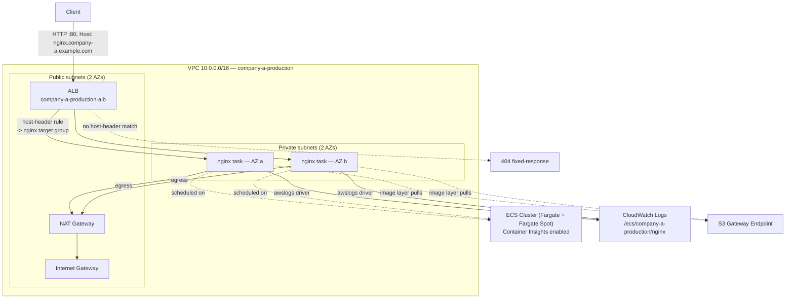

# AWS Infrastructure — Terraform + Terragrunt

[](https://github.com/amit-barda/Terraform-Terragrunt-DevOps/actions/workflows/ci.yml)
[](https://github.com/amit-barda/Terraform-Terragrunt-DevOps/actions/workflows/cd.yml)

Multi-company, multi-environment AWS infrastructure. Each `(company, environment)`
pair deploys into its own AWS account. Currently implements a VPC + ECS
Fargate + ALB stack for `company-a/production`, running a vanilla `nginx`
service behind host-header based routing.

## Architecture (`company-a/production`)



Traffic flow: client → ALB (public subnets) → host-header listener rule →
target group → nginx tasks (private subnets, Fargate). Tasks have no public
IP; outbound internet access (e.g. pulling `nginx:stable`) goes through the
single NAT gateway. Any request whose `Host` header doesn't match a
configured rule gets the listener's default 404 response instead of being
forwarded anywhere.

## Repository structure

```
.
├── root.hcl                     # Terragrunt root: generates S3 backend + AWS provider (assume_role) per company/env
├── live/
│   ├── company-a/
│   │   ├── staging/              # account.hcl / env.hcl / region.hcl only — not built out (see Part B scope)
│   │   └── production/           # fully implemented
│   │       ├── account.hcl       # company name, account id (placeholder), IAM role to assume
│   │       ├── env.hcl           # environment = "production"
│   │       ├── region.hcl        # aws_region
│   │       ├── networking/terragrunt.hcl
│   │       ├── ecs-cluster/terragrunt.hcl
│   │       ├── alb/terragrunt.hcl
│   │       └── ecs-service/nginx/terragrunt.hcl
│   └── company-b/                # placeholder company — structure only, proves the pattern scales
│       ├── staging/
│       └── production/
└── modules/                      # reusable, environment-agnostic Terraform modules
    ├── networking/                # VPC, public+private subnets (2 AZs), NAT, route tables, S3 endpoint
    ├── ecs-cluster/                # ECS cluster, Fargate/Fargate Spot capacity providers, Container Insights
    ├── ecs-service/                # generic Fargate service: task def, service, awslogs, SG, least-priv IAM
    └── alb/                        # internet-facing ALB, host-header routing, default 404
```

Each environment directory carries three config files, read by `root.hcl`
via `read_terragrunt_config(find_in_parent_folders(...))`:

| File | Contents |
|---|---|
| `account.hcl` | `company_name`, `account_name`, `account_id` (placeholder), `aws_role_name` |
| `env.hcl` | `environment` (`staging` / `production`) |
| `region.hcl` | `aws_region` |

Because `account.hcl` lives at the **environment** level (not the company
level), every environment gets its own AWS account — `root.hcl` uses that
`account_id` to generate a distinct S3 backend and `assume_role` provider
config per environment, from a single shared root file.

### Dependency graph (`company-a/production`)

```
networking ──┬──> alb ──────────┐
             └──> ecs-cluster ──┼──> ecs-service/nginx
                                └──(alb target group + SG)
```

Each component's `terragrunt.hcl` declares `dependency` blocks with
`mock_outputs` (restricted to `plan`/`validate` — never `apply`), so any
component can be planned independently before the ones it depends on have
ever been applied.

## Prerequisites

- Terraform >= 1.5.0, Terragrunt (latest — this repo relies on the modern
  `root.hcl` convention and `hcl fmt`/`hcl validate`/`render` subcommands)
- AWS credentials for the target account, able to assume `aws_role_name`
  from `account.hcl`
- The state backend (S3 bucket + DynamoDB table) already bootstrapped for
  that account — see below

## State backend bootstrap (one-time, per account)

`root.hcl` expects an S3 bucket and DynamoDB table to already exist before
the first `terragrunt init` in that account:

- Bucket: `tfstate-<company_name>-<account_id>` (versioning + encryption on)
- DynamoDB table: `tflock-<company_name>-<account_id>` (partition key `LockID`, string)

This is deliberately **not** managed by Terraform itself (a backend can't
create the bucket it's about to store its own state in). Create it once,
by hand or with a small separate bootstrap script, per account — e.g. for
`company-a/production`:

```bash
aws s3api create-bucket --bucket tfstate-company-a-222222222222 --region us-east-1
aws s3api put-bucket-versioning --bucket tfstate-company-a-222222222222 \
  --versioning-configuration Status=Enabled
aws dynamodb create-table --table-name tflock-company-a-222222222222 \
  --attribute-definitions AttributeName=LockID,AttributeType=S \
  --key-schema AttributeName=LockID,KeyType=HASH \
  --billing-mode PAY_PER_REQUEST
```

## Deploying

From inside any environment directory, Terragrunt resolves the dependency
graph automatically:

```bash
cd live/company-a/production
terragrunt run-all plan
terragrunt run-all apply
```

Or one component at a time, in dependency order:

```bash
cd live/company-a/production/networking && terragrunt apply
cd ../ecs-cluster && terragrunt apply
cd ../alb && terragrunt apply
cd ../ecs-service/nginx && terragrunt apply
```

To add a new company or environment: copy an existing environment's
`account.hcl`/`env.hcl`/`region.hcl` (with the new account ID), then either
copy the component `terragrunt.hcl` files from `company-a/production` or
start from an empty structure like `company-b` — no changes to `root.hcl`
or `modules/` are needed either way.

## CI / CD

### CI — `.github/workflows/ci.yml`

Runs on every push and pull request to `main`. None of the core jobs need
AWS credentials — they validate the code statically:

| Job | What it checks |
|---|---|
| `fmt` | `terraform fmt -check -recursive` + `terragrunt hcl fmt --check` |
| `validate` | `terraform validate` for each module (no backend) + `terragrunt hcl validate` for the live configs |
| `lint` | `tflint` (recommended ruleset) against each module |
| `plan` | *Opt-in.* Real `terragrunt run-all plan` against AWS via OIDC. Off unless the repo variable `ENABLE_PLAN=true` is set — see the workflow comments. |

The `validate` job works without any applied state because the `dependency`
blocks fall back to `mock_outputs`, exactly as they do locally.

### CD — `.github/workflows/cd.yml`

Deploys to a real AWS account: a `plan` job followed by an `apply` job that
is gated on a GitHub **Environment** (`production`) so it pauses for manual
approval before touching infrastructure. Triggered on pushes to `main` that
touch `live/`, `modules/`, or `root.hcl`, and via manual `workflow_dispatch`
(with a selectable target path).

Because it needs cloud credentials, CD is **off by default** and only runs
when the repository variable `ENABLE_CD=true` is set. Enabling it requires,
one time:

1. The state backend bootstrapped (see above).
2. An IAM role assumable via GitHub OIDC, its ARN stored in the secret
   `AWS_DEPLOY_ROLE_ARN`.
3. A GitHub Environment named `production` with required reviewers (this is
   what turns the `apply` job into an approval gate).
4. The repository variable `ENABLE_CD=true`.

Authentication is OIDC — no long-lived AWS keys are stored in the repo.

## Design decisions

- **`root.hcl`, not `terragrunt.hcl`, for the root config.** Terragrunt
  treats every file literally named `terragrunt.hcl` as an
  independently-validatable config; a root file that only makes sense when
  `include`d by a child breaks that assumption (confirmed directly — see
  Terragrunt's own [migration guide](https://docs.terragrunt.com/migrate/migrating-from-root-terragrunt-hcl)).
- **`account.hcl`/`env.hcl`/`region.hcl` at the environment level.** Since
  every environment needs its own AWS account, the account ID has to live
  where it can differ per environment — the company level can't express that.
- **Each component passes only the inputs its own module declares**, rather
  than the root forwarding a blanket `merge()` of every `.hcl` local as
  `inputs`. Terragrunt inputs become `TF_VAR_*` environment variables;
  passing keys a module never declared produces a
  `Value for undeclared variable` warning on every single plan/apply. Confirmed
  this by testing the wired root config directly.
- **State key uses `replace(path_relative_to_include(), "\\", "/")`.**
  `path_relative_to_include()` returns OS-native separators — backslashes on
  Windows. Since this repo is meant to run identically from a Windows laptop
  and Linux CI, an un-normalized key would silently point the two at
  different state files for the same environment. Confirmed the bug and the
  fix by inspecting the generated `backend.tf`.
- **One NAT gateway, not one per AZ.** Keeps cost and resource count down for
  this assignment; it's a single point of failure for private-subnet
  egress, called out explicitly rather than hidden. A production-hardened
  version would use one NAT gateway per AZ.
- **Default security group is locked down to zero rules** (`aws_default_security_group`),
  per CIS AWS Foundations Benchmark 5.3 — nothing should be able to
  accidentally rely on the VPC's default SG.
- **S3 gateway VPC endpoint** (free) so ECR image-layer pulls and other S3
  traffic from Fargate tasks stay on the AWS backbone instead of paying for
  NAT data processing.
- **`ecs-service` execution role has exactly two permissions**
  (`logs:CreateLogStream`, `logs:PutLogEvents`, scoped to that service's own
  log group ARN) — no ECR permissions, since `nginx:stable` is pulled from
  public Docker Hub, and no task role, since nginx never calls an AWS API.
- **The service's security group only allows ingress from the ALB's security
  group** (by SG reference, not a CIDR), not from the whole VPC.
- **`dependency` blocks restrict `mock_outputs` to `plan`/`validate`**,
  deliberately excluding `apply` — applying a component against a
  placeholder VPC ID from a mock would silently create broken
  infrastructure pointed at nothing.
- **Naming convention**: `name_prefix = "<company>-<environment>"` (e.g.
  `company-a-production`), with each resource adding its own
  type/component suffix (`-vpc`, `-ecs-cluster`, `-alb`, `-nginx-sg`, ...).
  Every resource also gets `Company`/`Environment`/`ManagedBy=terraform` via
  the provider's `default_tags`, generated once in `root.hcl` — modules
  don't need to repeat those tags themselves.
- **`company-b` is intentionally empty** beyond its `account.hcl`/`env.hcl`/`region.hcl` —
  it exists to prove the pattern scales to a new company with zero changes
  to `root.hcl` or `modules/`.

## Known limitations / next steps

- No HTTPS listener / ACM certificate — HTTP only, matching the assignment scope.
- No autoscaling (`aws_appautoscaling_target`) on the ECS service — fixed `desired_count`.
- Single NAT gateway (see above) — one gateway per AZ would remove that SPOF.
- CD is provided but off by default (needs a real account + backend bootstrap
  to enable); it has not been exercised against live AWS from this repo.
